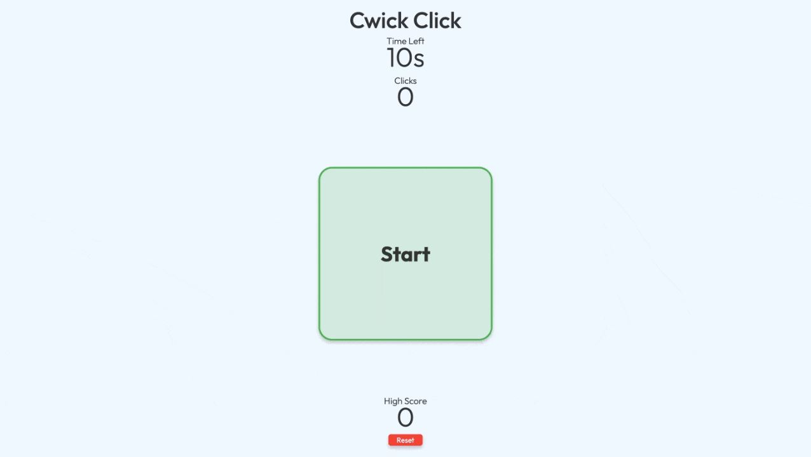
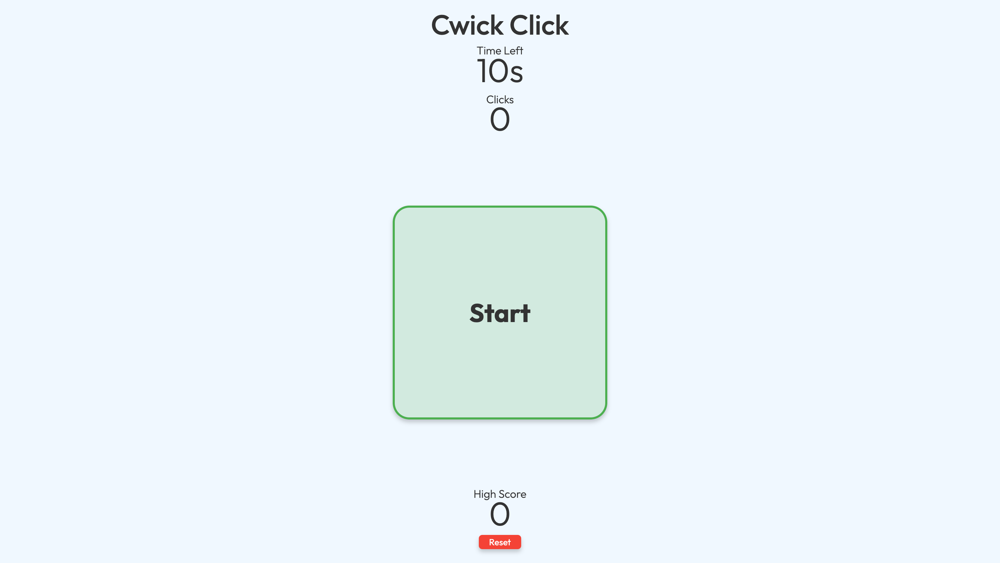
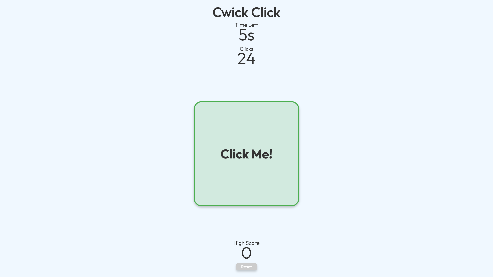
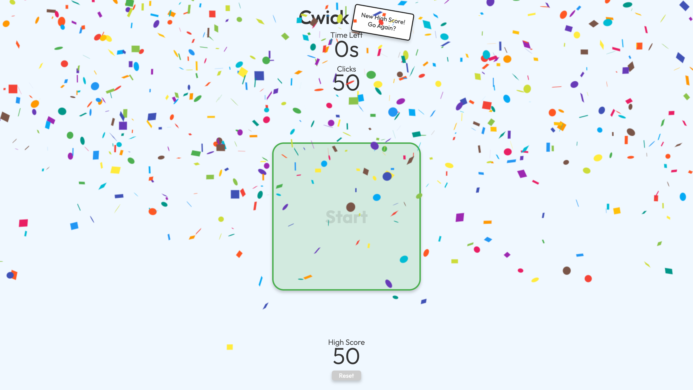
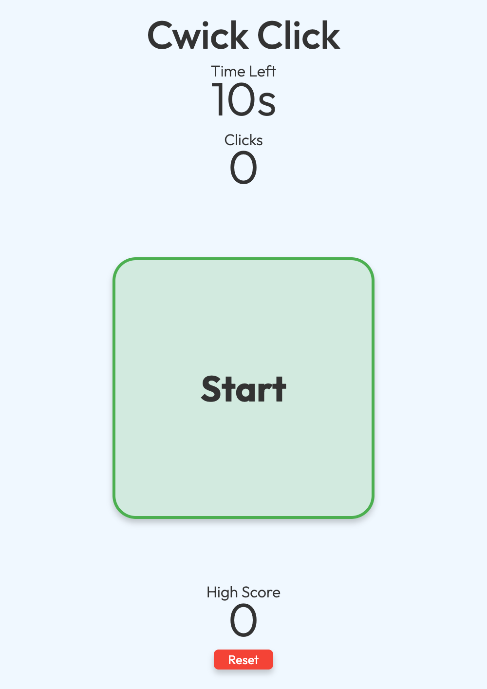

# Cwick Click


<p align="center">
  
</p>

A fast-paced React web game that transforms a simple tapping challenge into an engaging experience through responsive animations, real-time visual feedback, and multi-touch support.

---

## 🌐 Live Demo

[](https://cwickclick.netlify.app/)

Optimised for desktop and mobile browsers.

---

## 📋 Table of Contents

- [Overview](#-overview)
- [Project Motivation](#-project-motivation)
- [Key Skills Demonstrated](#-key-skills-demonstrated)
- [Features](#-features)
- [Technologies Used](#-technologies-used)
- [Getting Started](#-getting-started)
- [What I Learned](#-what-i-learned)
- [Challenges](#-challenges)
- [Future Improvements](#-future-improvements)
- [Screenshots](#-screenshots)
- [License](#-license)

---

## 📌 Overview

Cwick Click is a lightweight React game that challenges players to tap as quickly as possible before time runs out.

Although the gameplay is intentionally simple, the project focuses on creating an energetic and satisfying experience through responsive interactions, immediate visual feedback, and support for multiple simultaneous touch inputs. Whether played with a mouse or on a touchscreen device, every tap is designed to feel fast, accurate, and rewarding.

The project demonstrates practical frontend concepts including React state management, event handling, responsive design, animation, timing logic, and mobile-first interaction patterns.

---

## 🎯 Project Motivation

I built Cwick Click as a fun game to compete with friends while exploring how responsive user interactions can transform a simple idea into an enjoyable experience.

Rather than creating a basic click counter, I wanted every tap to feel immediate and rewarding through visual feedback, smooth animations, and responsive gameplay. One of my main goals was to implement multi-touch support, allowing players on touch devices to tap with multiple fingers simultaneously instead of being limited to a single pointer.

Throughout development, I also had the opportunity to strengthen my understanding of:

- React state management
- Handling rapid user interactions
- Multi-touch event handling
- Real-time UI updates
- Timing and game logic
- Responsive design
- Creating engaging micro-interactions

---

## 💪 Key Skills Demonstrated

- React component architecture
- React Hooks (`useState`, `useEffect`, `useRef`)
- Event handling
- Pointer Events with multi-touch support
- State management
- Real-time UI updates
- Responsive web design
- Animation and visual feedback
- Timing logic
- Mobile-first interaction design
- User experience (UX) design

---

## ✨ Features

### 👆 Multi-touch Gameplay

- Supports multiple simultaneous touch inputs
- Allows players to tap with several fingers at once
- Provides a more engaging experience on touch devices

### ⚡ Real-Time Score Updates

- Instant score updates after every successful tap
- Responsive interface designed to keep gameplay feeling fast and satisfying

### ⏱️ Countdown Timer

- Fixed game duration creates a simple competitive challenge
- Real-time countdown keeps players focused throughout each round

### 🎉 Personal Best Tracking

- Automatically saves your highest score using `localStorage`
- Celebrates new personal bests with a confetti animation
- Encourages replayability by tracking your best performance across sessions

### ✨ Responsive Visual Feedback

- Immediate visual response to user input
- Smooth animations that enhance the gameplay experience
- Designed to make every interaction feel rewarding

### 📱 Mobile-Friendly Design

- Fully responsive layout
- Optimised for both desktop and touchscreen devices
- Touch-first gameplay supported across modern mobile browsers

---

## 🛠 Technologies Used

### Frontend

- React
- JavaScript (ES6+)
- HTML5
- CSS3

### Development Tools

- Vite
- ESLint

### Browser APIs

- Touch Events
- Pointer Events
- Timer API (`setInterval` / `setTimeout`)

---

## 🚀 Getting Started

### Clone the repository

```bash
git clone https://github.com/adameasom/click-counter.git
```

### Navigate to the project directory

```bash
cd click-counter
```

### Install dependencies

```bash
npm install
```

### Start the development server

```bash
npm run dev
```

The application will be available at:

```text
http://localhost:5173
```

---

## 📚 What I Learned

Although Cwick Click is intentionally simple, building it gave me valuable experience designing interfaces that feel responsive and enjoyable to use.

Throughout development, I strengthened my understanding of:

- Managing React state during rapid user interactions
- Handling both mouse and touch events across different devices
- Using Pointer Events to support both mouse and touch interactions
- Creating real-time UI updates without sacrificing responsiveness
- Designing animations and visual feedback that enhance user interaction
- Structuring components to keep game logic organised and maintainable
- Building responsive layouts that work consistently across desktop and mobile devices

One of the most rewarding parts of the project was implementing multi-touch support. Allowing players to tap with multiple fingers at once significantly changed how the game felt on mobile devices and introduced me to the differences between traditional mouse interactions and touch-based event handling.

The project also reinforced that even a very simple application can become far more engaging through thoughtful interaction design and attention to small user experience details.

---

## 🧩 Challenges

One of the biggest challenges was moving beyond a traditional click counter and creating gameplay that felt responsive and enjoyable.

Supporting multiple simultaneous touch inputs required a different approach to event handling than a standard mouse click implementation. Ensuring that multiple touches were detected accurately while maintaining smooth gameplay gave me valuable experience working with touch-based interactions.

Another challenge was providing immediate visual feedback without overwhelming the interface. Animations needed to reinforce each interaction while remaining subtle enough to keep the gameplay feeling fast and responsive.

Balancing simplicity with engagement was an important design consideration throughout the project. Every feature was evaluated based on whether it made the experience more enjoyable without introducing unnecessary complexity.

---

## 🔮 Future Improvements

Although Cwick Click is complete for its current scope, there are several ideas I would consider exploring in future versions:

- Multiple difficulty levels with adjustable game durations
- Online leaderboards or multiplayer support
- Additional game modes with different objectives
- Unlockable achievements or progression system
- Optional sound effects and background music
- Accessibility improvements, including keyboard support and reduced-motion options
- Expanded gameplay statistics, such as taps per second and session history

---

## 📷 Screenshots

### Desktop Gameplay

<p align="center">
  
</p>

---

### Active Gameplay

<p align="center">
  
</p>

---

### New Personal Best

<p align="center">
  
</p>

---

### Mobile View

<p align="center">
  
</p>

---

## 📄 License

This project is licensed under the MIT License.

See the [LICENSE](LICENSE) file for more information.